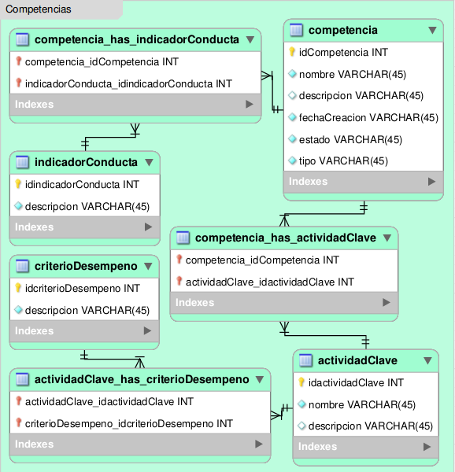

.. _modelo-relacional-competencias:

Modelo relacional: competencias
===============================

referencia del modelo:

.. _relaciones-competencias:

Tablas y Relaciones
===================

.. glossary::

   Tablas
      * competencia
      * indicadorConducta
      * actividadClave
      * criterioDesempeno
      * competencia_has_activdadClave
      * competencia_has_indicadorConducta
      * actividadClave_has_criterioDesempeno

   Relaciones
      * compentencia n...n competencia_has_activdadClave n...n actividadClave
      * compentencia n...n competencia_has_indicadorConducta n...n indicadorConducta
      * actividadClave n...n actividadClave_has_criterioDesempeno n...n criterioDesempeno

.. _esquema-competencias:

Esquema
=======

.. literalinclude:: competencias.sql
   :language: sql
   :caption: competencias.sql
   :name: competencias-sql

.. _recursos-competencias:

Recursos descargables
=====================

Recursos: :download:`PNG <model-competencias.png>` | :download:`SQL <competencias.sql>`

