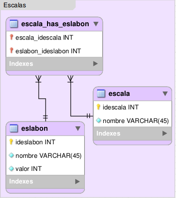

.. _modelo-relacional-escala:

Modelo relacional: escalas
==========================

referencia del modelo:

.. _relaciones-escala:

Tablas y Relaciones
===================

.. glossary::

   Tablas
      * escala
      * escala_has_eslabon
      * eslabon

   Relaciones
      * escala 1...n versionEscala
      * escala n...n escala_has_eslabon n...n eslabon

.. _esquema-escala:

Esquema
=======

.. literalinclude:: escalas.sql
   :language: sql
   :caption: escalas.sql
   :name: escalas-sql

.. _recursos-escalas:

Recursos descargables
=====================

Recursos: :download:`PNG <model-escalas.png>` | :download:`SQL <escalas.sql>`