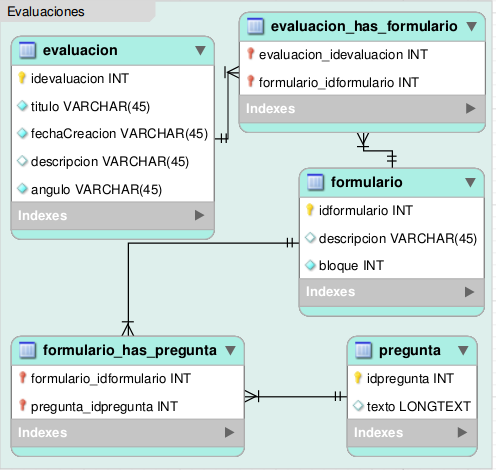

.. _modelo-relacional-evaluacion:

Modelo relacional: evaluaciones
===============================

referencia del modelo:

.. _relaciones-evaluacion:

Tablas y Relaciones
===================

.. glossary::

   Tablas
      * evaluacion
      * formulario
      * pregunta
      * evaluacion_has_formulario
      * formulario_has_pregunta

   Relaciones
      * evaluacion n...n evaluacion_has_formulario n...n formulario
      * formulario n...n formulario_has_pregunta n...n pregunta

.. _esquema-evaluacion:

Esquema
=======

.. literalinclude:: evaluaciones.sql
   :language: sql
   :caption: evaluaciones.sql
   :name: evaluaciones-sql

.. _recursos-evaluaciones:

Recursos descargables
=====================

Recursos: :download:`PNG <model-evaluaciones.png>` | :download:`SQL <evaluaciones.sql>`