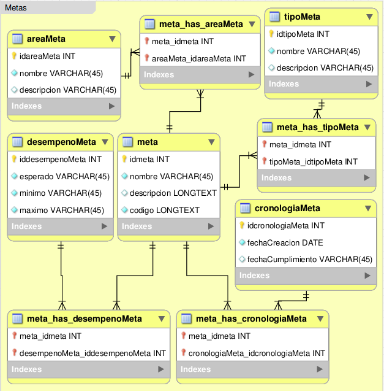

.. _modelo-relacional-metas:

Modelo relacional: metas
========================

referencia del modelo:

.. _relaciones-meta:

Tablas y Relaciones
===================

.. glossary::

   Tablas
      * meta
      * areaMeta
      * desempenoMeta
      * cronologiaMeta
      * tipoMeta
      * meta_has_areaMeta
      * meta_has_desempenoMeta
      * meta_has_cronologiaMeta
      * meta_has_tipoMeta

   Relaciones
      * meta n...n meta_has_areaMeta n...n areaMeta
      * meta n...n meta_has_desempenoMeta n...n desempenoMeta
      * meta n...n meta_has_cronologiaMeta n...n cronologiaMeta
      * meta n...n meta_has_tipoMeta n...n tipoMeta

.. _esquema-meta:

Esquema
=======

.. literalinclude:: metas.sql
   :language: sql
   :caption: metas.sql
   :name: metas-sql

.. _recursos-metas:

Recursos descargables
=====================

Recursos: :download:`PNG <model-metas.png>` | :download:`SQL <metas.sql>`