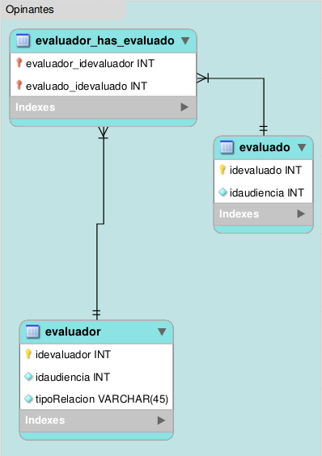

.. _modelo-relacional-opinante:

Modelo relacional: opinantes
============================

referencia del modelo:

.. _relaciones-opinante:

Tablas y Relaciones
===================

.. glossary::

   Tablas
      * evaluador
      * evaluado
      * evaluador_has_evaluado

   Relaciones
      * evaluador n...n evaluador_has_evaluado n...n evaluado

.. _esquema-opinante:

Esquema
=======

.. literalinclude:: opinantes.sql
   :language: sql
   :caption: opinantes.sql
   :name: opinantes-sql

.. _recursos-opinantes:

Recursos descargables
=====================

Recursos: :download:`PNG <model-opinantes.png>` | :download:`SQL <opinantes.sql>`