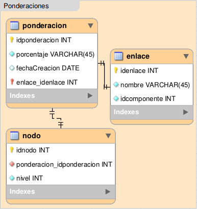

.. _modelo-relacional-ponderacion:

Modelo relacional: ponderaciones
================================

referencia del modelo:

.. _relaciones-ponderaciones:

Tablas y Relaciones
===================

.. glossary::

   Tablas
      * ponderacion
      * nodo
      * enlance

   Relaciones
      * ponderacion 1...1 enlace
      * ponderacion 1...n nodo

.. _esquema-ponderacion:

Esquema
=======

.. literalinclude:: ponderaciones.sql
   :language: sql
   :caption: ponderaciones.sql
   :name: ponderaciones-sql

.. _recursos-ponderaciones:

Recursos descargables
=====================

Recursos: :download:`PNG <model-ponderaciones.png>` | :download:`SQL <ponderaciones.sql>`