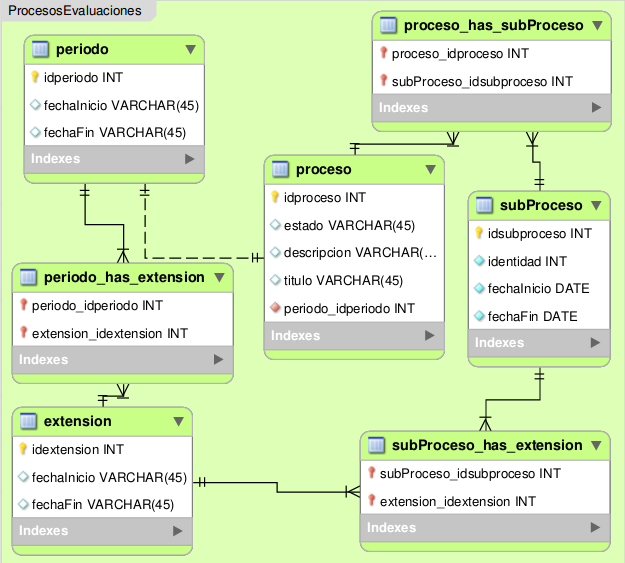

.. _modelo-relacional-proceso-evaluacion:

Modelo relacional: procesos evaluaciones
========================================

referencia del modelo:

.. _relaciones-proceso-evaluacion:

Tablas y Relaciones
===================

.. glossary::

   Tablas
      * proceso
      * periodo
      * subProceso
      * extension
      * proceso_has_subProceso
      * subProceso_has_extension
      * periodo_has_extension

   Relaciones
      * proceso 1...1 periodo
      * proceso n...n proceso_has_subProceso n...n subProceso
      * subProceso n...n subProceso_has_extension n...n extension
      * periodo n...n periodo_has_extension n...n extension

.. _esquema-proceso-evaluacion:

Esquema
=======

.. literalinclude:: procesosEvaluaciones.sql
   :language: sql
   :caption: procesosEvaluaciones.sql
   :name: procesosEvaluaciones-sql

.. _recursos-proceso-evaluacion:

Recursos descargables
=====================

Recursos: :download:`PNG <model-procesosEvaluaciones.png>` | :download:`SQL <procesosEvaluaciones.sql>`