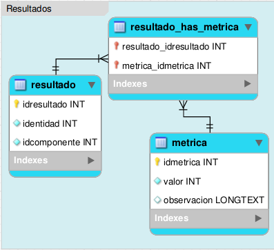

.. _modelo-relacional-resultado:

Modelo relacional: resultados
=============================

referencia del modelo:

.. _relaciones-resultado:

Tablas y Relaciones
===================

.. glossary::

   Tablas
      * resultado
      * metrica
      * resultado_has_metrica

   Relaciones
      * resultado n...n resultado_has_metrica n...n metrica

.. _esquema-resultado:

Esquema
=======

.. literalinclude:: resultados.sql
   :language: sql
   :caption: resultados.sql
   :name: resultados-sql

.. _recursos-resultados:

Recursos descargables
=====================

Recursos: :download:`PNG <model-resultados.png>` | :download:`SQL <resultados.sql>`