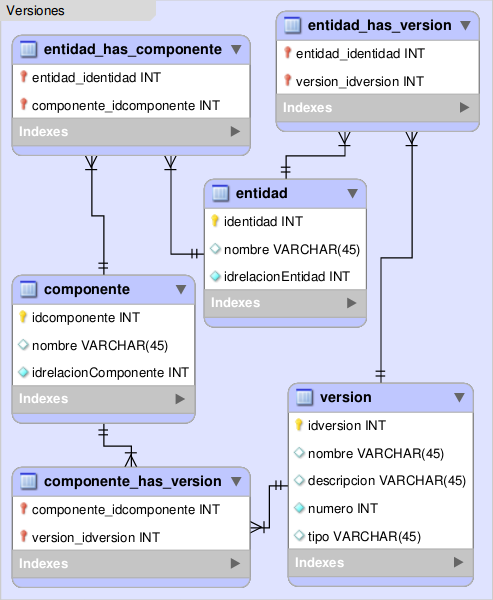

.. _modelo-relacional-version:

Modelo relacional: versiones
============================

referencia del modelo:

.. _relaciones-version:

Tablas y Relaciones
===================

.. glossary::

   Tablas
      * entidad
      * componente
      * version
      * entidad_has_version
      * entidad_has_componente
      * componente_has_version

   Relaciones
      * entidad n...n entidad_has_version n...n version
      * entidad n...n entidad_has_componente n...n componente
      * componente n...n componente_has_version n...n version

.. _esquema-version:

Esquema
=======

.. literalinclude:: versiones.sql
   :language: sql
   :caption: versiones.sql
   :name: versiones-sql

.. _recursos-versiones:

Recursos descargables
=====================

Recursos: :download:`PNG <model-versiones.png>` | :download:`SQL <versiones.sql>`